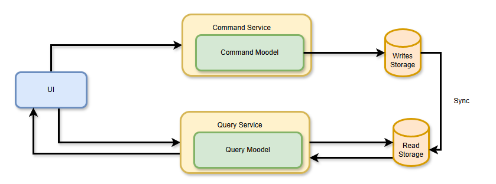

# Personal Finance Management Backend

A backend application for managing personal finances, built with Spring Boot and containerised using Docker. The system
implements the CQRS (Command Query Responsibility Segregation) pattern to separate write and read operations, ensuring
scalability and maintainability.

## Project Overview

**This backend system allows users to:**

* Record income and expenses.
* Define budgets and financial goals.
* Retrieve financial reports and spending analytics.

**The application adopts the CQRS pattern:**

* Command Module: Handles all write operations like adding, updating, and deleting data.
* Query Module: Handles all read operations like fetching transaction history, budget utilisation, and reports.

## Features

**Command Module:**

* Add, edit, and delete transactions.
* Create and manage budgets.
* Define financial goals.

**Query Module:**

* Fetch transaction history.
* Retrieve real-time budget utilisation.
* Generate detailed financial reports.

## Technologies Used

## Architecture

The project follows a modular design with clear separation of concerns:

**1. Command Module:**

* Handles all data-modifying operations.
* Publishes events to RabbitMQ for synchronising the query-side database.

**2. Query Module:**

* Handles data retrieval and analytics.
* Subscribes to events from RabbitMQ to update the read-side database.

Note: R&D all best practice for both database synchronization

**3. Databases:**

* PostgreSQL: Write-side database for transactional consistency.
* MongoDB: Read-side database for fast data retrieval.

**4. Message Broker:**

* RabbitMQ is used for communication between the command and query modules.

Note: R&D all best practice for both database synchronization

  
Self Study

## 1. What is the CQRS Design Pattern?

**CQRS (Command and Query Responsibility Segregation)** is an architectural pattern that separates an application’s
command **(aka writes)** and **query (aka reads)** operations into distinct components. The main idea is to use
different models for reading (queries) and writing (commands) data, thus optimizing the system for each operation’s
specific requirements.

In a traditional **monolithic architecture**, the same data model is often used for both reads and writes. This can lead
to inefficiencies, as read-heavy and write-heavy operations have different performance characteristics and scalability
needs.

CQRS addresses this by introducing **two separate models**: the Command Model and the Query Model.

1. **Command Model**

- Responsible for handling write operations or commands that modify the application’s state.
- Represents the “single source of truth” for data changes.
- Can use a domain-driven design (DDD) approach to encapsulate business logic and enforce invariants.

2. **Query Model**

- Handles read operations or queries that retrieve data without modifying the application’s state.
- Optimized for fast and efficient data retrieval based on specific use cases.
- Can be implemented using a read-only replica of the data store or specialized data structures.

---

## 2. Overcoming traditional architecture limitations with the CQRS pattern

1. **Separation of concerns**: CQRS separates the read and write operations into two distinct models: a Command model
   for handling writes and a Query model for handling reads. This allows each model to be optimised for its specific
   purpose.
2. **Improved scalability**: The read and write sides can be scaled independently. For example, if the system
   experiences high read traffic, only the query side needs to be scaled.
3. **Simplified business logic**: By decoupling the read and write logic, each side can focus on its specific
   responsibilities, making the system easier to understand and maintain.
4. **Flexibility in data storage**: The write side can use a relational database optimised for transactional
   consistency,
   while the read side can use a NoSQL database or caching mechanism optimised for fast queries.
5. **Support for eventual consistency**: CQRS naturally supports eventual consistency by allowing the read side to be
   updated asynchronously based on events generated by the write side.
6. **Better handling of complex domains**: CQRS often works well with Event Sourcing, where state changes are stored as
   a
   series of events. This makes it easier to manage complex business rules and provides a complete audit trail.

---

## 3. Understanding the basic architecture of the CQRS design pattern

The **Command Query Responsibility Segregation (CQRS)** design pattern separates the responsibilities of handling
commands (
write operations) and queries (read operations) into distinct models.

1. Command side (Write model):

**Purpose**: Handles all operations that modify the system's state, such as creating, updating, or deleting data.

2. Query side (Read model):

Purpose: Handles all operations that retrieve data from the system, often optimised for performance and scalability.

3. Event Bus (optional):

* Acts as a communication mechanism between the command and query sides.
* When a command modifies the state, it generates events that are published to the event bus.
* The query side listens to these events and updates the read database accordingly, ensuring eventual consistency.

4. Client interaction:

* Write operations: Clients send commands to the command side to modify the system's state.
* Read operations: Clients send queries to the query side to retrieve data.

## 4. Understanding the relationship between CQS and CQRS

1. CQS [Command Query Separation]: A design principle where a method either modifies the state (Command) or retrieves
   data (Query), but never both.

Example:

* Command: void updateCustomerName(String customerId, String newName)
* Query: String getCustomerName(String customerId)

2. CQRS (Command Query Responsibility Segregation): An architectural pattern that extends CQS by separating the read and
   write responsibilities into distinct models, often with separate databases and services.

Example:

* Command API: POST /orders to create an order.
* Query API: GET /orders/{orderId} to retrieve order details.

---
Scope:

* CQS: Applies to individual methods or functions.
* CQRS: Applies to the entire system architecture.

Data models:

* CQS: Single data model for both commands and queries.
* CQRS: Separate data models optimised for reads and writes.

Complexity:

* CQS: Simple and lightweight.
* CQRS: More complex, suitable for large-scale systems.

---

## 5. When to use the CQRS design pattern?

1. Complex business domains:

* When: The system has complex business rules or workflows that make it difficult to manage a single data model for both
  reads and writes.
* Why: CQRS allows you to separate the logic for commands and queries, simplifying the management of complex domains.
* Example: A financial system with intricate transaction rules and reporting requirements.

2. High read and write workloads:

* When: The system experiences a high volume of both read and write operations, and scaling a single model is
  challenging.
* Why: CQRS enables independent scaling of the read and write sides, optimising performance for each.
* Example: An e-commerce platform with frequent order placements (writes) and product catalogue views (reads).

3. Performance optimisation:

* When: The system requires fast query responses and efficient write operations.
* Why: CQRS allows the read and write sides to use separate databases optimised for their specific tasks (e.g., NoSQL
  for reads, relational for writes).
* Example: A real-time analytics dashboard that needs to display aggregated data quickly.

4. Event-driven systems:

* When: The system benefits from an event-driven architecture, where changes in state trigger events that other parts of
  the system react to.
* Why: CQRS works well with Event Sourcing, where state changes are stored as events, providing a complete audit trail
  and enabling eventual consistency.
* Example: A logistics system that tracks package movements and updates delivery statuses asynchronously.

5. Scalability and flexibility:

* When: The system needs to scale independently for read and write operations or adapt to changing requirements.
* Why: CQRS decouples the read and write sides, making it easier to scale and modify each independently.
* Example: A social media platform with high read traffic (e.g., news feeds) and moderate write traffic (e.g., posts and
  comments).

6. Distributed systems:

* When: The system is distributed across multiple services or locations, and eventual consistency is acceptable.
* Why: CQRS naturally supports eventual consistency, making it suitable for distributed architectures.
* Example: A global inventory management system that synchronises stock levels across multiple warehouses.

---
**When not to use CQRS:**

* Simple systems: If the system has straightforward requirements, the added complexity of CQRS is unnecessary.
* Low traffic: For systems with low read and write demands, a traditional architecture is sufficient.
* Immediate consistency required: If the system cannot tolerate eventual consistency, CQRS may not be suitable.

---

## 6. How to sync databases with the CQRS design pattern

**1. Event-driven synchronisation**

> How it works:

* When a command modifies the state in the write database, it generates an event (e.g., "OrderCreated", "OrderUpdated").
* These events are published to an event bus or message queue (e.g., RabbitMQ, Kafka).
* The query side listens to these events and updates the read database accordingly.

> Advantages:

* Decouples the write and read sides.
* Supports eventual consistency.
* Scales well in distributed systems.

> Example:

* A new order is created in the write database.
* An "OrderCreated" event is published.
* The query side processes the event and updates the read database with the new order details.

**2. Direct database synchronisation**

> How it works:

* After a command updates the write database, the same process directly updates the read database.

> Advantages:

* Simpler to implement.
* Ensures immediate consistency between the write and read databases.

> Disadvantages:

* Tightly couples the write and read sides, reducing flexibility.
* Less scalable for distributed systems.

> Example:

* A user updates their profile information.
* The write database is updated, and the same process updates the read database immediately.

**3. Batch processing**

> How it works:

* Changes in the write database are periodically exported and applied to the read database in batches.

> Advantages:

* Reduces the load on the system by processing updates in bulk.
* Suitable for systems where real-time updates are not critical.

> Disadvantages:

* Introduces a delay in synchronisation.
* Requires additional logic for batch processing.

> Example:

* A nightly job exports all new or updated orders from the write database and updates the read database.

**4. Change data capture (CDC)**

> How it works:

* Monitors changes in the write database (e.g., using database logs) and propagates them to the read database.
* Tools like Debezium or AWS Database Migration Service can be used for CDC.

> Advantages:

* Automates the synchronisation process.
* Minimises the need for custom event publishing logic.

> Disadvantages:

* Requires database support for change tracking.
* May introduce latency depending on the implementation.

> Example:

* A CDC tool detects an "OrderCreated" operation in the write database and updates the read database with the new order.

**5. Event sourcing (optional with CQRS)**

> How it works:

* Instead of storing the current state in the write database, all state changes are stored as events in an event store.
* The query side rebuilds the read database by replaying these events.

> Advantages:

* Provides a complete history of state changes.
* Simplifies synchronisation, as the read database can be rebuilt at any time.

> Disadvantages:

* More complex to implement.
* Requires additional storage for the event store.

> Example:

* An "OrderCreated" event is stored in the event store.
* The query side processes the event and updates the read database.

